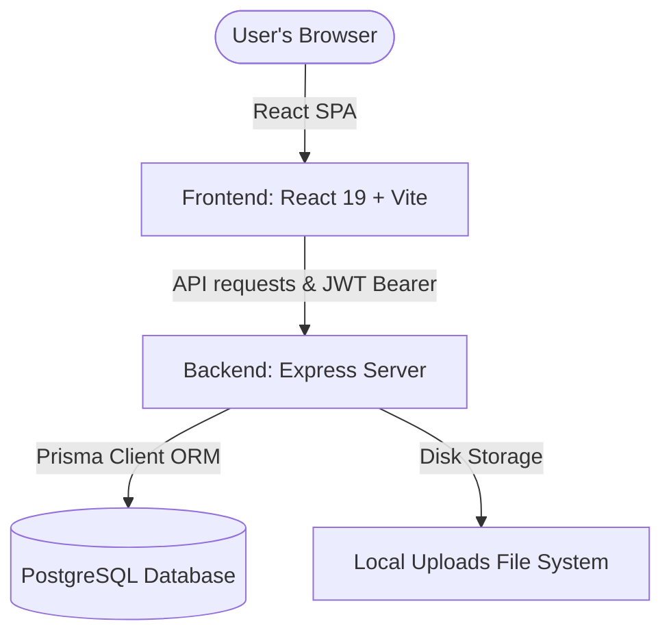
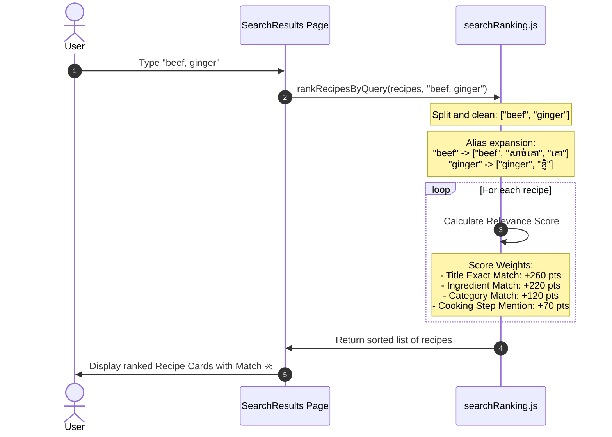
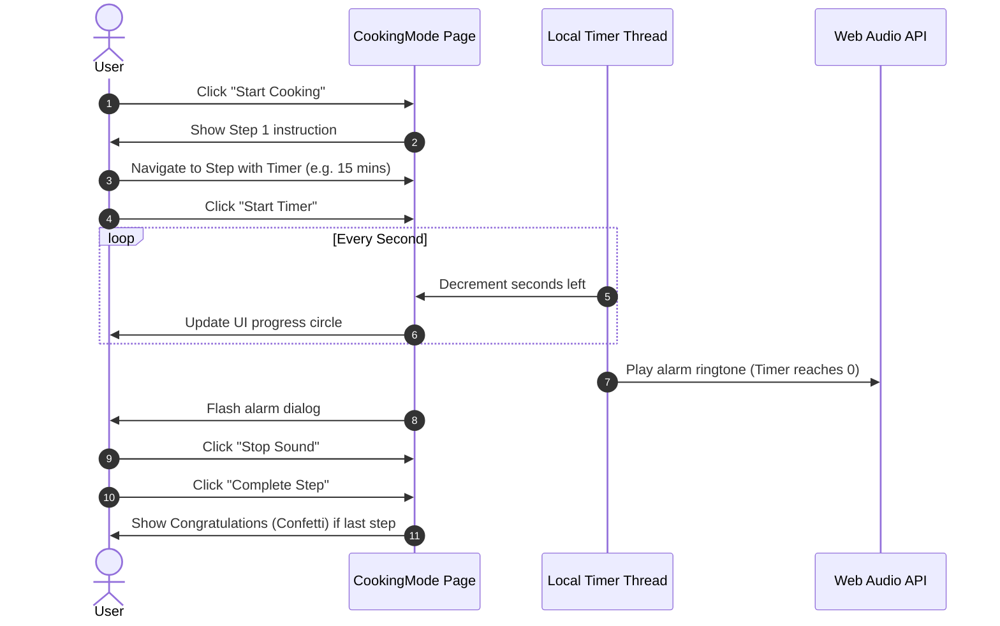
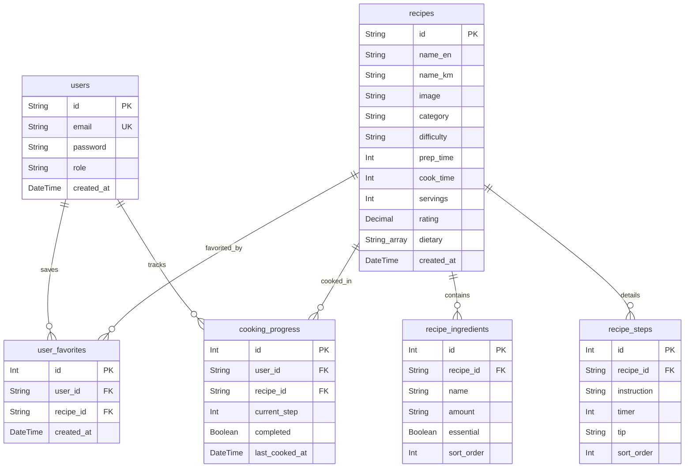

# Flamer Chef: Comprehensive Project & Technical Report

**Flamer Chef** is a state-of-the-art web application designed to help users search, organize, and prepare authentic Cambodian dishes using ingredients they already have in their kitchen. By prioritizing food waste reduction and local-first accessibility, it bridges the gap between home-cooking convenience and professional recipe management.

---

## 1. Executive Summary & Brand Identity

* **Name**: Flamer Chef (ហ្វ្លេមមឺ ឆេហ្វ)
* **Core Value**: "Cook Like a Chef with What You Have" (ចម្អិនអាហារដូចមេចុងភៅដោយប្រើគ្រឿងផ្សំដែលអ្នកមាន)
* **Goal**: Provide a bilingual (English/Khmer) interactive platform for culinary discovery, centering on traditional Cambodian cuisine (Amok, Lok Lak, Kuy Teav, Samlor Kari).
* **Brand Aesthetic**: Warm, premium, and culinary-focused. It uses a modern dark theme accentuating fire-orange and bright mustard-yellow elements, representing heat, stir-fry ("Flamer"), and appetite.

---

## 2. Key Features & Capabilities

### 🔍 Smart Fridge Bilingual Match Engine
A search algorithm designed to map raw user queries (comma-separated lists of ingredients or dish names) to recipes. It expands terms using synonyms (e.g., matching "សាច់គោ" to "beef" and vice versa) and scores them based on relevance.

### ⏱️ Interactive Step-by-Step Cooking Assistant
A specialized "Cooking Mode" that breaks down selected recipes into individual stages. It features:
* Interactive count-down timers (with system notifications and alarms).
* Tip callouts and chef advice for complex culinary techniques.
* Step completion indicators to track cooking progress.

### 🖨️ Multi-Format Recipe Export
Leverages `html2canvas` and `jsPDF` to compile styled recipes, ingredients lists, and instructions into a high-quality PDF. This allows users to download and print recipes for offline kitchen use.

### 🔐 Secure Admin CRUD Panel
Provides recipe creators and system administrators with a private dashboard to:
* Add and update recipe profiles, ingredients, instructions, and durations.
* Securely upload food dish cover images using an Express storage service.
* Authenticate through a JWT token-based mechanism with password hashing (`bcryptjs`).

---

## 3. Technical Architecture & Tech Stack

### Frontend Stack
* **Vite & React 19**: Lightning-fast hot reloading and modular component rendering.
* **React Router v7**: Declarative routing between Home, Search, Recipe Details, Cooking Mode, and Admin Panel.
* **Lucide React**: High-quality SVG icons.
* **jsPDF & html2canvas**: Client-side document assembly and PDF rendering.
* **Canvas Confetti**: Visual celebration for completing a recipe cooking session.

### Backend Stack
* **Node.js & Express**: High-performance RESTful API endpoints.
* **JWT & BcryptJS**: Stateless authorization and credentials protection.
* **Prisma ORM**: Modern database access and schema migrations.
* **Multer**: Multi-part form-data parser for recipe image uploads.

---

## 4. System Workflows & Algorithmic Design

### A. Smart Search & Ranking Workflow
The core of Flamer Chef is the search ranking engine (`src/lib/searchRanking.js`). When a user inputs ingredients like `"beef, ginger"`, the system processes it as follows:

### B. Interactive Cooking Mode & Timer Lifecycle

---

## 5. Database Schema & Data Design

The database schema (`schema.prisma`) represents a normalized structure mapping users, recipes, ingredients, steps, and user logs.

---

## 6. Marketing Campaign & Advertising Assets

A modern marketing campaign has been proposed to highlight the app's ease of use and focus on delicious Cambodian food. 

### Design Goals of the Advertising Creative:
1. **Showcase Authenticity**: Present signature dishes like *Fish Amok* (steamed in traditional banana leaves) and *Beef Lok Lak* to resonate immediately with the target demographic.
2. **Promote the "Fridge to Table" Concept**: Emphasize how the smart search feature helps users find cooking guides using leftover ingredients.
3. **Bridge Kitchen & Technology**: Place a mobile mockup directly in a rich kitchen atmosphere to show how clean and user-friendly the step-by-step assistant is.

### Promotional Campaign Banner:
Below is the generated high-end advertising graphic for the campaign:

